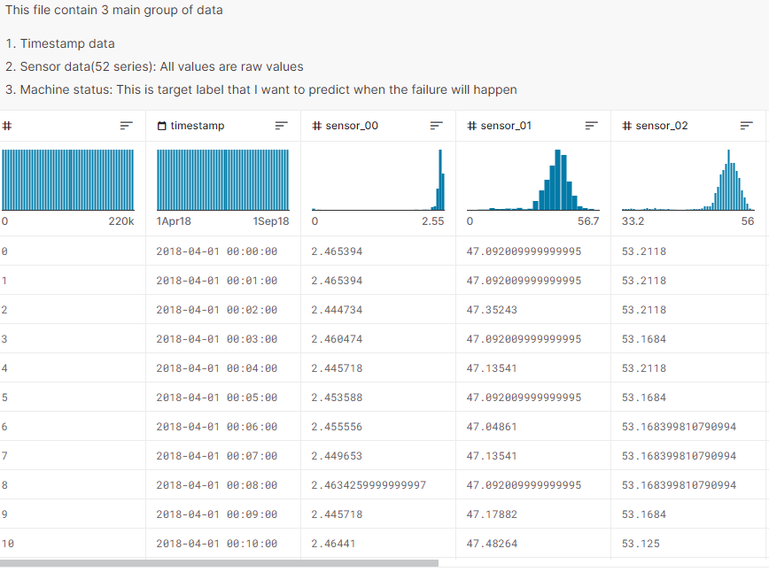

# POC InfluxDB
 Providing real-time analytics APIs for time series data based on InfluxDB can be a great way to enable other developers to easily build an IoT platform. By creating these APIs, other developers can access and query the data stored in InfluxDB without the need for additional software or expertise.

#### Loading Data
- download data from [pump-sensor-data kaggle](https://www.kaggle.com/datasets/nphantawee/pump-sensor-data) into `resources/`
  
- seperate datasets files for each sensors and machine status as I wish to simulate multiple measurements.
- create measurements for all sensors as format (machine,sensor=sensor1 value=xxxx timestamp)
- Load data via channel and goroutine.

#### Install InfluxDB
following download guide in `https://portal.influxdata.com/downloads/`

#### Integrate with InfluxDB
- create measurements.
- stream data to measurement.
- create query all data with mean values in minute.

#### Definition of Measurement on platform
- Define Measurement name
- Define limit number of tags
- Upload file with only one column of value.
- Upload file with multiple columns of value.
- Upload file with one/multiple columns of tags and a columns of value.
- Upload file with one/multiple columns of tags and multiple columns of value.

#### Measurement sevice
- Create measurement
  - struct: name, description, status [created, archived]
  - store in mongodb
- Archive measurement
  - update status in mongo
- Get measurement
- List measurement

#### Batch service
- Create a new batch.
  - struct: path, status, measure_id.
  - upload file
  - create batch in db.
- Get batch by id
- List batch by measurement.
- Process the batch by workers

#### Stream service
- Stream data from edge device to platform
- platform will implement server gRPC.
- struct of measurement to stream and line protocol as string
- Create a new stream